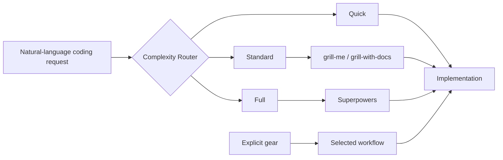

<p align="center">
  
</p>

<p align="center"><strong>The right development process for the task at hand.</strong></p>

<p align="center">
  <a href="README.zh-CN.md">简体中文</a> ·
  <a href="#-30-second-start">Quickstart</a> ·
  <a href="#-how-it-works">How it works</a> ·
  <a href="#-command-reference">Commands</a>
</p>

<p align="center">
  <a href="LICENSE"></a>
  
  
</p>

## 🚦 Why Gearshift exists

[Superpowers](https://github.com/obra/superpowers) reliably addresses difficult agent-coding failures with brainstorming, design approval, detailed plans, isolated worktrees, TDD, reviews, and verification. That rigor is valuable for migrations and architectural work.

But a button color change should not pay for brainstorming, a design spec, detailed planning, a worktree, TDD, and multiple review stages.

Gearshift was born from using Superpowers deeply and hitting that mismatch repeatedly. It is a complexity-aware router and integration layer: small changes stay fast, bounded work gets enough alignment, and genuinely complex work still receives the complete Superpowers methodology. Gearshift scales the process; it does not replace Superpowers.

## ⚙️ Three gears

| Gear | Best for | Workflow | New tests |
| --- | --- | --- | --- |
| **Quick** ⚡ | Clear, localized changes | Inspect → edit → proportionate verification | Not required |
| **Standard** 🧭 | Bounded work with a few unresolved decisions | Focused grilling → short plan → implement → existing checks | Ask after implementation |
| **Full** 🏗️ | Migrations, module rewrites, architecture, cross-system work | Complete Superpowers path | TDD is part of the workflow |



Natural language is classified automatically and continues without an extra confirmation. An explicit gear always wins. If hidden complexity appears, Gearshift explains the boundary and upgrades according to the selection rules.

## 📦 Installation

### Requirements

- Node.js 18 or newer.
- Codex or Claude Code.
- Quick has no third-party workflow dependency.
- Standard uses externally installed [`grill-me` and `grill-with-docs`](https://github.com/mattpocock/skills).
- Full uses an externally installed compatible [Superpowers](https://github.com/obra/superpowers).

Gearshift never vendors or modifies those third-party Skills, so they remain independently upgradable.

### Source checkout (MVP)

```bash
git clone https://github.com/bowlofnoodles/gearshift.git
cd gearshift
npm test
```

For Claude Code, load the checkout directly:

```bash
claude --plugin-dir /absolute/path/to/gearshift
```

Codex installs plugins from configured marketplace snapshots. Until Gearshift has a public marketplace listing, add this checkout through your local Codex marketplace and install it with:

```bash
codex plugin add gearshift@<your-local-marketplace>
```

Public Codex and Claude Code marketplace installation is planned after the MVP stabilizes. The repository does not claim a listing that does not exist yet.

## 🏁 30-second start

After installing the plugin, open the repository you want to work on and initialize it once:

| Codex | Claude Code |
| --- | --- |
| `$gearshift:init` | `/gear:init` |

Initialization creates the shared `.gear/` structure, adds a versioned Gearshift block to `AGENTS.md` and/or `CLAUDE.md`, installs nested runtime ignore rules, and runs Doctor. It preserves user-owned text and is safe to run again.

Then describe work naturally:

```text
Change the checkout button to blue.
Add batch refunds; ask me how partial failures should behave.
Extract payments into a standalone service.
```

Expected routes: Quick, Standard, and Full respectively.

## 🧠 How it works

Gearshift is the only top-level workflow router when installed in an initialized repository. The managed project guidance and startup hook tell the agent to classify coding work before loading another workflow controller. This matters because implicit Skill matching does not provide a reliable total order between independently installed plugins.

When Gearshift and Superpowers are both installed:

- Quick runs directly and never expands into Superpowers.
- Standard delegates focused discovery to `grill-me` or `grill-with-docs`.
- Full invokes the complete Superpowers workflow.

An explicit command bypasses classification. For example, `$gearshift:full` remains Full even for a tiny edit; Gearshift never silently downgrades it. Explicit Quick pauses for permission if the requested work crosses a complexity boundary.

## 🎛️ Command reference

| Action | Codex | Claude Code | Purpose |
| --- | --- | --- | --- |
| Initialize | `$gearshift:init` | `/gear:init` | Create or repair the managed repository setup |
| Quick | `$gearshift:quick` | `/gear:quick` | Implement a clear localized change directly |
| Standard | `$gearshift:standard` | `/gear:standard` | Clarify and plan bounded work |
| Full | `$gearshift:full` | `/gear:full` | Run the rigorous complex-work workflow |
| Continue | `$gearshift:continue` | `/gear:continue` | Resume interrupted Standard or Full work from repository evidence |
| Doctor | `$gearshift:doctor` | `/gear:doctor` | Diagnose setup without changing files |

`continue` exists because Standard and Full work can span sessions. It reads task state, artifacts, Git status, and current changes, then resumes the first incomplete phase without repeating completed grilling or planning. Quick intentionally has no resumable task record.

`doctor` is read-only. It checks dependency compatibility, managed guidance, `.gear/`, ignore rules, routing fixtures, and stray workflow documents. Gearshift updates are handled by the plugin distribution mechanism; an automatic `update` command is intentionally outside the MVP.

## 🗂️ One artifact home

All design and workflow documents live under `.gear/`, regardless of which downstream Skill produced them:

```text
.gear/
├── config.yaml
├── index.md
├── context/
│   ├── architecture.md
│   └── glossary.md
├── adr/
├── tasks/
│   └── YYYY-MM-DD-task-name/
│       ├── task.json
│       ├── brief.md
│       ├── design.md
│       ├── plan.md
│       └── summary.md
└── .runtime/
```

Shared artifacts are committed. `.gear/.runtime/`, `*.tmp`, and `*.lock` are ignored by `.gear/.gitignore`; therefore `init` creates the ignore rules together with the directory. Do not ignore the whole `.gear/` directory at repository root.

Quick creates no task directory by default. Standard creates a concise task record and plan. Full creates the complete design and plan set. Delegated Skills receive canonical absolute paths, and Gearshift reports—without deleting—documents accidentally written to upstream default locations.

## 🔌 Relationship to other tools

- **Superpowers** is Gearshift's Full engine, unchanged and independently installed.
- **grill-me / grill-with-docs** provide focused questioning for Standard work.
- **Trellis** is a broader spec-and-project workflow. Gearshift's narrower concern is choosing proportional process and keeping documents in one artifact contract; teams may still use Trellis conventions around it if they do not introduce a second top-level router.

## 🔐 Hooks and trust

The bundled `SessionStart` hook only checks for `.gear/config.yaml` and emits compact routing context. It does not classify a task or write files. In Codex, review and trust installed plugin hooks through `/hooks` before enabling them. Claude Code uses the equivalent bundled hook from the plugin directory.

## 🩺 Troubleshooting

### Superpowers starts before Gearshift

Run `init` again and inspect the managed block in `AGENTS.md` or `CLAUDE.md`. Then run `doctor`. Confirm the Gearshift startup hook is enabled and trusted. Natural-language coding requests should enter Gearshift first; Superpowers is downstream of Full.

### Standard or Full reports a missing dependency

Quick still works. Install the named dependency separately, then run `doctor` again. Gearshift never installs or upgrades third-party Skills without approval.

### `.gear/` is not committed

Check the root `.gitignore`. A rule such as `/.gear/` hides shared artifacts and must be removed manually. Keep only the nested `.gear/.gitignore` runtime rules.

### A workflow document appeared elsewhere

Run `doctor`. Gearshift reports `CONTEXT.md` and `docs/superpowers/specs/` conflicts but preserves them so references are not broken silently.

## ❓ FAQ

**Is this a fork of Superpowers?**  
No. Gearshift calls a compatible external Superpowers installation only for Full work.

**Does Standard forbid tests?**  
No. It runs relevant existing checks, but new tests are a post-implementation choice rather than mandatory TDD.

**Can I always force a gear?**  
Yes. Explicit selection takes precedence. An explicit Quick request that becomes substantially more complex pauses for permission to upgrade.

**Why write `AGENTS.md` if there is a Router Skill?**  
Because two independently installed plugins may both match natural language. The managed block gives the repository a durable, reviewable precedence rule without editing either third-party plugin.

## 🤝 Contributing

See [CONTRIBUTING.md](CONTRIBUTING.md). Routing-policy changes should include corpus cases and tests.

## 📄 License

Gearshift is released under the [MIT License](LICENSE).
