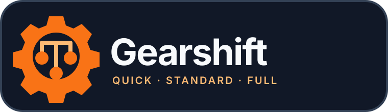
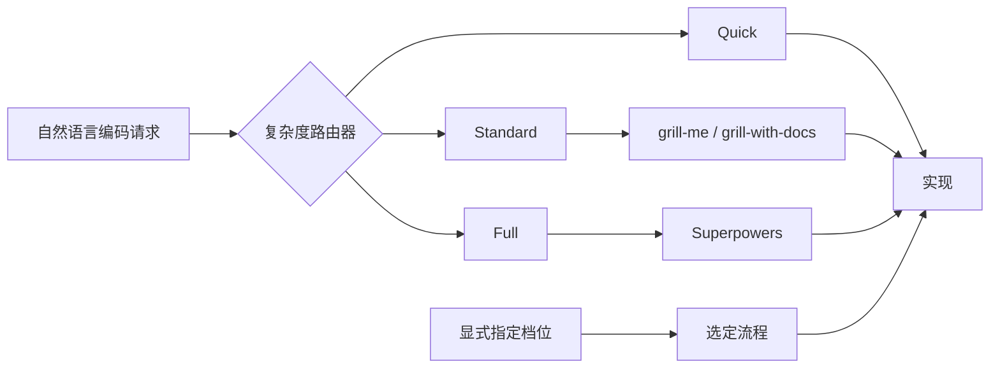

<p align="center">
  
</p>

<p align="center"><strong>为手头的任务，选择恰到好处的开发流程。</strong></p>

<p align="center">
  <a href="README.md">English</a> ·
  <a href="#-30-秒上手">快速开始</a> ·
  <a href="#-工作原理">工作原理</a> ·
  <a href="#️-命令参考">命令</a>
</p>

<p align="center">
  <a href="https://github.com/bowlofnoodles/gearshift/actions/workflows/ci.yml"></a>
  <a href="LICENSE"></a>
  
  
</p>

## 🚦 Gearshift 为什么会诞生

[Superpowers](https://github.com/obra/superpowers) 能用 brainstorming、设计确认、详细计划、隔离 worktree、TDD、评审与验证，可靠地解决棘手的 Agent Coding 问题。这套严谨流程对迁移和架构工作非常有价值。

但只改一个按钮颜色，不应该也付出 brainstorming、设计文档、详细计划、worktree、TDD 和多轮评审的完整成本。

Gearshift 来自长期深度使用 Superpowers 后反复遇到的这一错配。它是一个按任务复杂度工作的路由器和集成层：小修改保持快速，边界明确的任务获得足够的对齐，真正复杂的工作仍然进入完整的 Superpowers 方法。Gearshift 调节流程强度，而不是取代 Superpowers。

## ⚙️ 三个档位

| 档位 | 适合任务 | 流程 | 新增测试 |
| --- | --- | --- | --- |
| **Quick** ⚡ | 清晰、局部的修改 | 检查 → 修改 → 按比例验证 | 不强制 |
| **Standard** 🧭 | 有少量未决问题、边界明确的工作 | 聚焦追问 → 短计划 → 实现 → 现有检查 | 实现后询问 |
| **Full** 🏗️ | 迁移、模块重写、架构和跨系统工作 | 完整 Superpowers 路径 | 流程包含 TDD |



自然语言请求会自动分类并继续执行，不多等一次确认。显式档位永远优先。如果中途发现隐藏复杂度，Gearshift 会解释越过了什么边界，并按选择规则升档。

## 📦 安装

### 环境要求

- Node.js 18 或更高版本。
- Codex 或 Claude Code。
- Quick 不依赖第三方工作流。
- Standard 使用外部安装的 [`grill-me` 与 `grill-with-docs`](https://github.com/mattpocock/skills)。
- Full 使用外部安装且版本兼容的 [Superpowers](https://github.com/obra/superpowers)。

Gearshift 不会复制或修改这些第三方 Skills，因此它们仍可独立升级。

### Codex Marketplace 预览版

```bash
codex plugin marketplace add bowlofnoodles/gearshift --ref main
codex plugin add gearshift@gearshift
```

安装后新建一个 Codex 任务，让 Gearshift Skills 和 Hook 被重新加载。以后更新 Git marketplace 并重新安装当前版本：

```bash
codex plugin marketplace upgrade gearshift
codex plugin add gearshift@gearshift
```

这是 Gearshift 自己维护的仓库 marketplace 预览版，并不是 OpenAI curated marketplace 上架版本。

### Claude Code 源码加载

```bash
git clone https://github.com/bowlofnoodles/gearshift.git
claude --plugin-dir /absolute/path/to/gearshift
```

## 🏁 30 秒上手

安装插件后，打开要开发的仓库，只需初始化一次：

| Codex | Claude Code |
| --- | --- |
| `$gearshift:init` | `/gear:init` |

初始化会创建共享的 `.gear/` 结构，在 `AGENTS.md` 和/或 `CLAUDE.md` 中加入带版本的 Gearshift 托管区块，写入嵌套的运行时忽略规则，并运行 Doctor。用户自己维护的文字会被保留，重复运行也安全。

之后直接用自然语言描述工作：

```text
把结账按钮改成蓝色。
增加批量退款；先问我部分失败应该怎么处理。
把支付能力抽成独立服务。
```

它们预期分别进入 Quick、Standard 和 Full。

## 🧠 工作原理

在已初始化的仓库里，Gearshift 是唯一的顶层工作流路由器。项目中的托管说明和启动 Hook 会要求 Agent 先判断任务复杂度，再加载其他工作流控制器。这一点很重要：多个独立安装的插件同时匹配自然语言时，隐式 Skill 匹配并不存在可靠的全序优先级。

当 Gearshift 和 Superpowers 同时安装时：

- Quick 直接执行，不会展开 Superpowers。
- Standard 把聚焦澄清委托给 `grill-me` 或 `grill-with-docs`。
- Full 调用完整 Superpowers 流程。

显式命令会跳过分类。例如，即使只是小改动，`$gearshift:full` 仍保持 Full，Gearshift 不会静默降档。显式 Quick 如果越过复杂度边界，会暂停并请求升档许可。

## 🎛️ 命令参考

| 操作 | Codex | Claude Code | 用途 |
| --- | --- | --- | --- |
| 初始化 | `$gearshift:init` | `/gear:init` | 创建或修复仓库中的托管配置 |
| Quick | `$gearshift:quick` | `/gear:quick` | 直接实现清晰的局部修改 |
| Standard | `$gearshift:standard` | `/gear:standard` | 澄清并规划边界明确的工作 |
| Full | `$gearshift:full` | `/gear:full` | 对复杂工作运行完整严谨流程 |
| 继续 | `$gearshift:continue` | `/gear:continue` | 根据仓库证据恢复中断的 Standard 或 Full 任务 |
| Doctor | `$gearshift:doctor` | `/gear:doctor` | 只诊断配置，不修改文件 |

`continue` 的存在，是因为 Standard 与 Full 可能跨会话完成。它读取任务状态、产物、Git 状态和当前修改，从第一个未完成阶段继续，不会重复已经完成的追问或规划。Quick 刻意不创建可恢复的任务记录。

`doctor` 是只读的。它检查依赖兼容性、托管说明、`.gear/`、忽略规则、路由样例和散落的工作流文档。Gearshift 的更新交给插件分发机制处理；自动 `update` 命令刻意不在 MVP 范围内。

## 🗂️ 统一的文档目录

无论下游使用了哪个 Skill，所有设计和工作流文档都写进 `.gear/`：

```text
.gear/
├── config.yaml
├── index.md
├── context/
│   ├── architecture.md
│   └── glossary.md
├── adr/
├── tasks/
│   └── YYYY-MM-DD-task-name/
│       ├── task.json
│       ├── brief.md
│       ├── design.md
│       ├── plan.md
│       └── summary.md
└── .runtime/
```

共享产物进入版本控制；`.gear/.runtime/`、`*.tmp` 和 `*.lock` 由 `.gear/.gitignore` 忽略。因此 `init` 会在创建目录的同时写入这些规则。不要在仓库根 `.gitignore` 中忽略整个 `.gear/`。

Quick 默认不创建任务目录。Standard 创建简洁的任务记录和计划。Full 创建完整的设计与计划文档。Gearshift 会给被委托的 Skill 提供规范化绝对路径；如果文档误写到了上游默认目录，它只报告，不会擅自删除。

## 🔌 与其他工具的关系

- **Superpowers** 是 Gearshift 的 Full 引擎，保持原样并独立安装。
- **grill-me / grill-with-docs** 为 Standard 工作提供聚焦追问。
- **Trellis** 是更广泛的规格与项目工作流。Gearshift 更专注于选择与任务匹配的流程，并用一个产物契约统一文档；只要不引入第二个顶层路由器，团队仍可在外围使用 Trellis 约定。

## 🔐 Hooks 与信任

内置 `SessionStart` Hook 只检查 `.gear/config.yaml` 并输出简短的路由上下文，不会分类任务，也不会写文件。在 Codex 中，启用前请通过 `/hooks` 查看并信任已安装插件的 Hook。Claude Code 会从插件目录使用等价的内置 Hook。

## 🩺 故障排查

### Superpowers 在 Gearshift 之前启动

重新运行 `init`，检查 `AGENTS.md` 或 `CLAUDE.md` 中的托管区块，再运行 `doctor`。确认 Gearshift 启动 Hook 已启用并受信任。自然语言编码请求应先进入 Gearshift，Superpowers 只是 Full 的下游引擎。

### Standard 或 Full 提示缺少依赖

Quick 仍然可用。单独安装提示中的依赖，再次运行 `doctor`。Gearshift 不会在未经批准时安装或升级第三方 Skills。

### `.gear/` 没有被提交

检查根目录 `.gitignore`。像 `/.gear/` 这样的规则会隐藏共享产物，必须手动移除。只保留嵌套 `.gear/.gitignore` 中的运行时规则。

### 工作流文档出现在别处

运行 `doctor`。Gearshift 会报告 `CONTEXT.md` 和 `docs/superpowers/specs/` 冲突，但会保留文件，避免静默破坏引用。

## ❓ FAQ

**这是 Superpowers 的 fork 吗？**  
不是。Gearshift 只在 Full 工作中调用外部安装且版本兼容的 Superpowers。

**Standard 禁止写测试吗？**  
不禁止。它会运行相关现有检查，但是否新增测试是实现后的选择，而不是强制 TDD。

**我能始终强制指定档位吗？**  
可以。显式选择优先。显式 Quick 如果明显变复杂，会暂停并请求升档许可。

**已经有 Router Skill，为什么还要写 `AGENTS.md`？**  
因为两个独立安装的插件可能同时匹配自然语言。托管区块给仓库一个持久、可审查的优先级规则，同时不修改任何第三方插件。

## 🤝 参与贡献

请阅读 [CONTRIBUTING.md](CONTRIBUTING.md)。修改路由策略时，应同时增加语料案例和测试。

## 📄 License

Gearshift 使用 [MIT License](LICENSE) 发布。
